# AskMobi

AskMobi is a chatbot-based solution facilitating the process of searching for desired datasets, backed by a granular dataset taxonomy and filtering capabilities.

## Explainer Video

[Link to explainer video](https://drive.google.com/file/d/1Nk2m565AZSDlsg2JY_5Z1OoD200MRGr3/view?usp=sharing)

## Link to prototype

[https://askmobi.ml/](https://askmobi.ml/)

## Background

AskMobi is a software solution which was developed by students of Technical University Munich during the Tech Challenge in the summer semester 2021/2022 for the [Mobility Data Space](https://mobility-dataspace.eu/). MDS has stated the challenge to analyze the readiness of this dataspace for the startup ecosystem. This guide will explain the idea and how the prototype was built.

### How do we help

<table>
  <tr>
   <td>Searchability
   </td>
   <td>Currently, there exist only a limited amount of searchable keywords based on the data structure of the MDS
   </td>
   <td>Time savings by providing a quick and intuitive keyword search functionality
   </td>
  </tr>
  <tr>
   <td>Accuracy
   </td>
   <td>The MDS lacks a tag-based data structure including a needed level of granularity and accuracy
   </td>
   <td>Increased search accuracy by implementing a granular and searchable data taxonomy
   </td>
  </tr>
  <tr>
   <td>Filterability
   </td>
   <td>Filtering possibilities are either insufficient or completely missing
   </td>
   <td>Filtering possibilities that allow to only display the search result a user is really interested in.
   </td>
  </tr>
</table>

### Data Taxonomy

Our solution includes more than 480 data categories and 11 filters curated, aggregated, and structured from 8 leading databases. Our Taxonomy includes data on the environment, public transport, vehicle- and ride-sharing, the mobility infrastructure, as well as OEM-specific data.

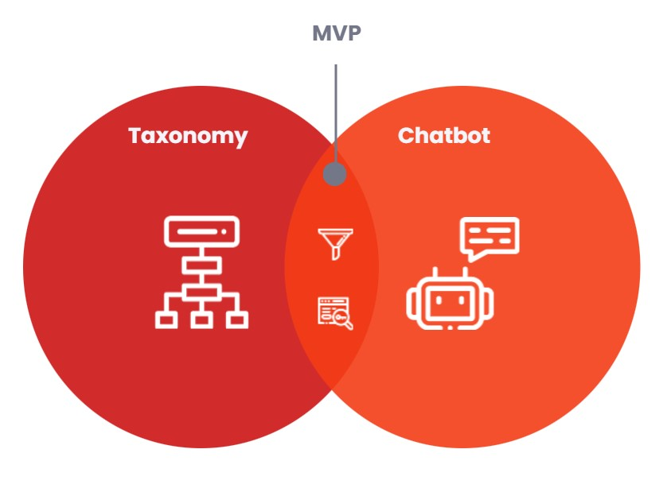

### Key Differentiators

<table>
  <tr style="font-weight:bold">
   <td>Competitor
   </td>
   <td>Conversational
   </td>
   <td>Keyword Search
   </td>
   <td>Front-end Taxonomy
   </td>
   <td>Filter Capabilities
   </td>
   <td>Granularity
   </td>
   <td>Data Variability
   </td>
  </tr>
  <tr style="font-weight:bold">
   <td>AskMobi (MDS)
   </td>
   <td>X
   </td>
   <td>X
   </td>
   <td>X
   </td>
   <td>X
   </td>
   <td>X
   </td>
   <td>X
   </td>
  </tr>
  <tr>
   <td>Gala-X
   </td>
   <td>
   </td>
   <td>X
   </td>
   <td>X
   </td>
   <td>X
   </td>
   <td>X
   </td>
   <td>X
   </td>
  </tr>
  <tr>
   <td>Caruso Dataplace
   </td>
   <td>
   </td>
   <td>X
   </td>
   <td>X
   </td>
   <td>X
   </td>
   <td>X
   </td>
   <td>
   </td>
  </tr>
  <tr>
   <td>Catena-X
   </td>
   <td>
   </td>
   <td>X
   </td>
   <td>X
   </td>
   <td>X
   </td>
   <td>X
   </td>
   <td>
   </td>
  </tr>
  <tr>
   <td>MobilityDB
   </td>
   <td>X
   </td>
   <td>
   </td>
   <td>X
   </td>
   <td>
   </td>
   <td>X
   </td>
   <td>
   </td>
  </tr>
  <tr>
   <td>Mobility Database (TransitFeeds)
   </td>
   <td>
   </td>
   <td>
   </td>
   <td>X
   </td>
   <td>X
   </td>
   <td>X
   </td>
   <td>X
   </td>
  </tr>
</table>

### Tools used

#### Software/Technology Stack:

<table>
  <tr style="font-weight:bold">
   <td>Tool
   </td>
   <td>Usage
   </td>
   <td>Reference
   </td>
  </tr>
  <tr>
   <td>Landbot.io
   </td>
   <td>Implementation of chatbot
   </td>
   <td><a href="https://landbot.io">https://landbot.io</a> 
   </td>
  </tr>
  <tr>
   <td>Microsoft Excel
   </td>
   <td>Implementation of logic of data taxonomy
   </td>
   <td>-
   </td>
  </tr>
  <tr>
   <td>WordPress
   </td>
   <td>Implementation of mock-up MDS Website
   </td>
   <td><a href="https://wordpress.com">https://wordpress.com</a> 
   </td>
  </tr>
  <tr>
   <td>VS Code IDE
   </td>
   <td>Code Editor
   </td>
   <td><a href="https://code.visualstudio.com">https://code.visualstudio.com</a> 
   </td>
  </tr>
  <tr>
   <td>Chrome Browser
   </td>
   <td>Testing of website in different screen sizes
   </td>
   <td>-
   </td>
  </tr>
  <tr>
   <td>Docker
   </td>
   <td>Platform that use OS-level virtualization to deliver software in packages called containers
   </td>
   <td><a href="https://www.docker.com/">https://www.docker.com/</a> 
   </td>
  </tr>
  <tr>
   <td>Digital Ocean
   </td>
   <td>Cloud infrastructure to host the website
   </td>
   <td><a href="https://www.digitalocean.com/">https://www.digitalocean.com/</a> 
   </td>
  </tr>
  <tr>
   <td>Nginx
   </td>
   <td>Web server
   </td>
   <td><a href="https://www.nginx.com/">https://www.nginx.com/</a> 
   </td>
  </tr>
  <tr>
   <td>Freenom
   </td>
   <td>Domain Provider
   </td>
   <td><a href="https://www.freenom.com/en/index.html?lang=en">https://www.freenom.com/en/index.html?lang=en</a> 
   </td>
  </tr>
</table>

#### Hardware:

Electronic devices with any size including mobile, tablet and desktop.

## Prototype

The Mobi chatbot will be a mean of communication between the user and the data space mobility. Therefore, this communication will take place in the interface that offers the data.

We recreated the data space mobility website, as the interface where the user can easily interact with the chatbot:

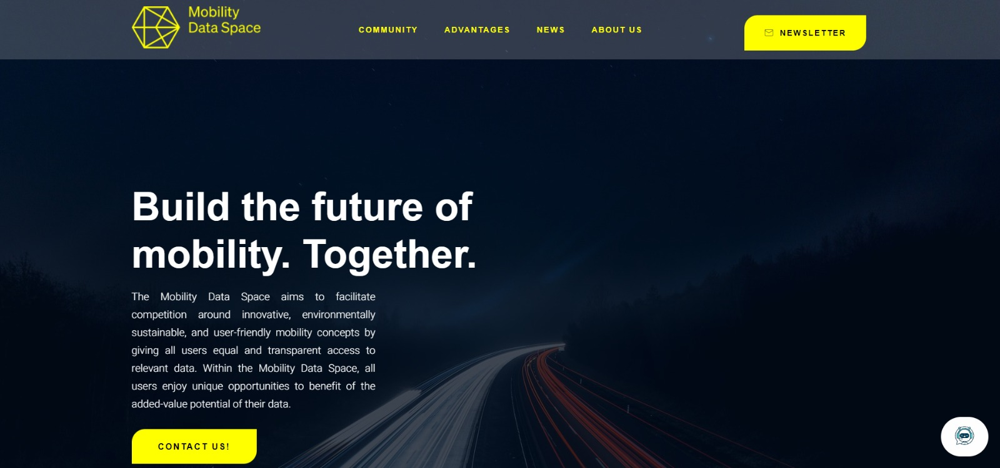

The chosen platform for designing the interface was WordPress.

The conversation starts when the user clicks on the white circle on the right bottom side.

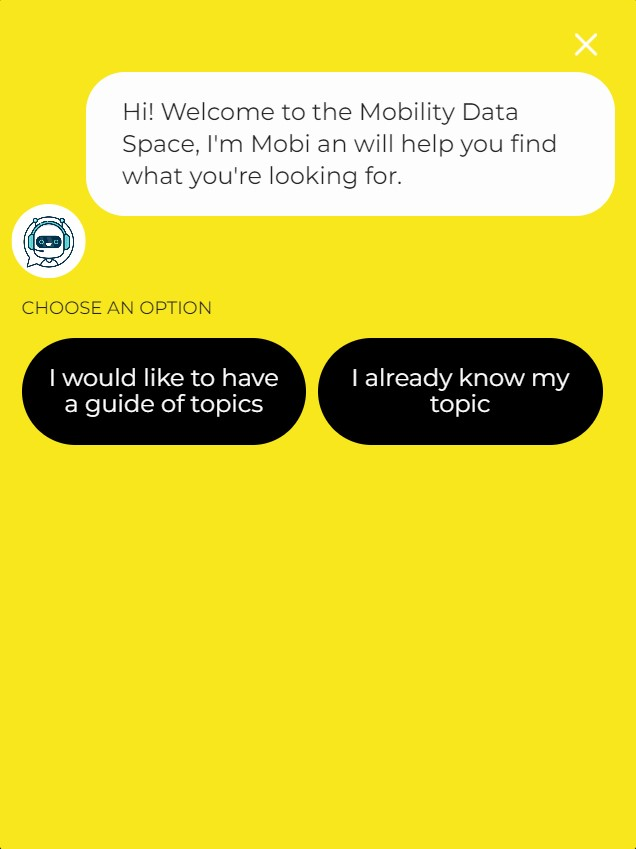

An interactive conversation will start in order to guide the user to the dataset that he/she is looking for.

### Chatbot

#### Pre-Execution:

The goals kept in mind to achieve a user-friendly and efficient tool were:

- Interactive and short questions
- Human-like bot
- Short but efficient conversation

There will be two ways of guiding the user:

1. By going node by node until finding the desired dataset topic
2. By jumping to the desired topic through the insertion of keywords

The first is based on a line of questions where the user lowers on the level of the taxonomy tree per question until reaching an ending node.

The second works by asking the user to insert keywords, where if there is a successful match among any node in the taxonomy tree, the user is guided through the following nodes that the selected node has, skipping all the higher levels of the tree.

#### Execution:

The platform used for the design and execution of the prototype was Landbot. The design is done by drag and drop features that are connected among them to indicate how the logic should be followed.

Along the diagram, 6 types of blocks were used. Followed by the description of the function, an explanatory block is shown:

1. Message:

This feature outputs a text that will be shown in the conversation.

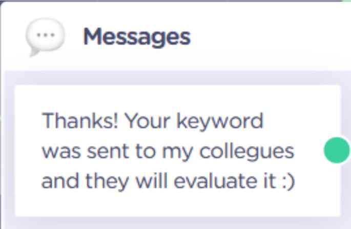

2. Buttons:

Followed by a text, buttons will be given with different options on paths to take. Each path is linked to another node.

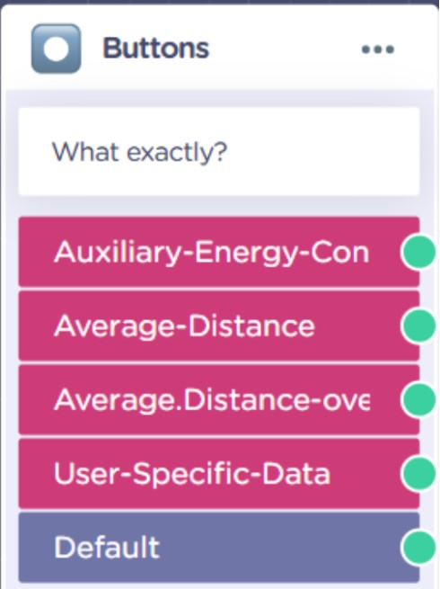

3. Question Text:

The chatbot will ask the user for a text input and the text is saved in a string variable.

4. Keyword Jump:

Receives a string variable as input and if it matches one of the nodes inside the tree it jumps to the matching node.

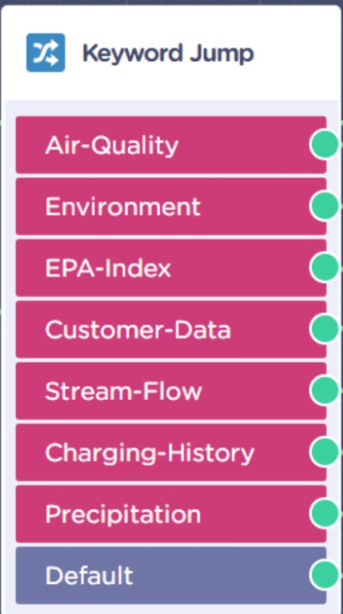

5. Send email:

Receives a string variable as input and sends the word to a previously entered email address.

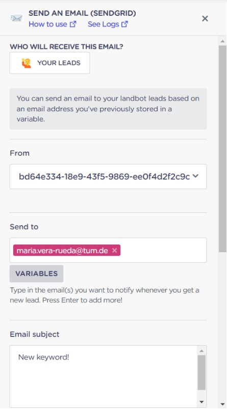

Each of the features were used for the following tasks:

1. Message:

Welcome and goodbye message, indication that the inserted keyword was sent by email. All the ending nodes will be linked to a goodbye message. This one, has an add-on feature that the moment the conversation ends, the user can be redirected to an assigned URL. The URL will be the direction to the requested datasets.

2. Buttons:

For every node in the taxonomy tree there is a button to press that either takes the user to the next level of the tree or to the goodbye message that redirects the user to the dataset.

3. Question Text:

The chatbot asks the user if he/she already knows the word he/she is looking for, if yes, a text input is required. The text is saved in a variable called @name 

4.  Keyword Jump:

The input is the word @name. If the variable matches with one of the listed keywords saved in the feature it redirects the user to the given keyword. If the variable is not matched, a default path is followed. The user is asked if he/she agrees on sending the unfound keyword to the software developer as an improvement suggestion of the taxonomy.

5. Send email:

If the user agrees on sending the keyword to the previously assigned email address, the word will immediately arrive to the inbox of the address.

#### Overview of the chatbot taxonomy

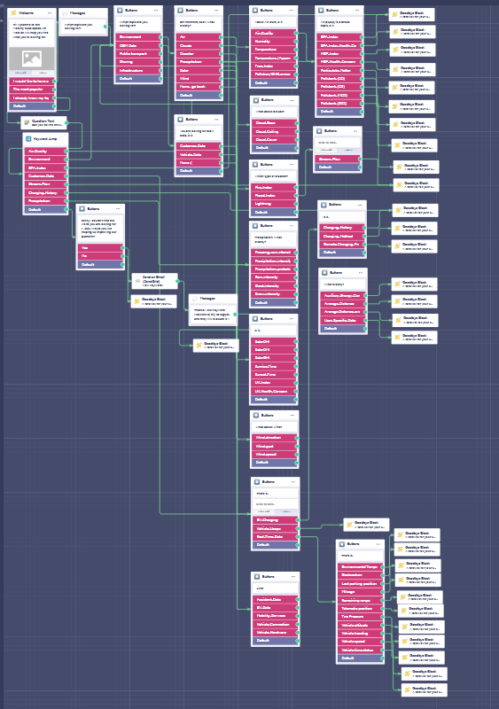

*the chatbot was filled with a portion of the taxonomy tree as an illustrative prototype

### Website Setup

The website was setup based on the guide by Digital Ocean

[How To Install WordPress With Docker Compose](https://www.digitalocean.com/community/tutorials/how-to-install-wordpress-with-docker-compose)

Gutenverse theme was used to design the website.

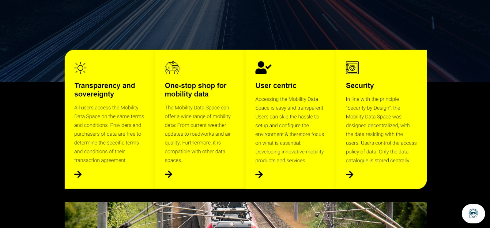
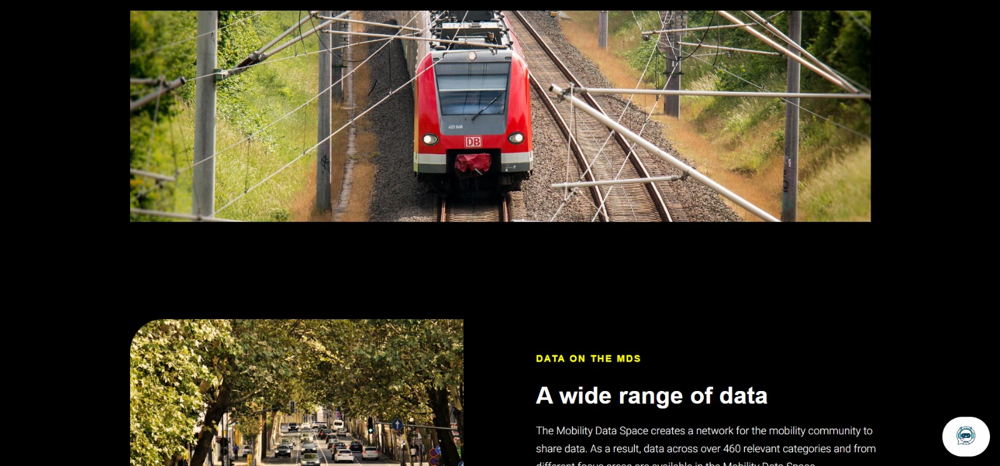
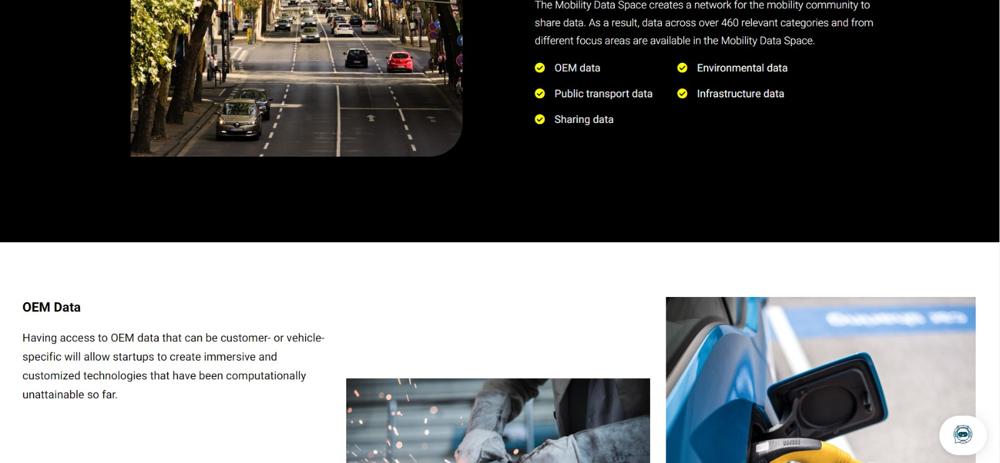
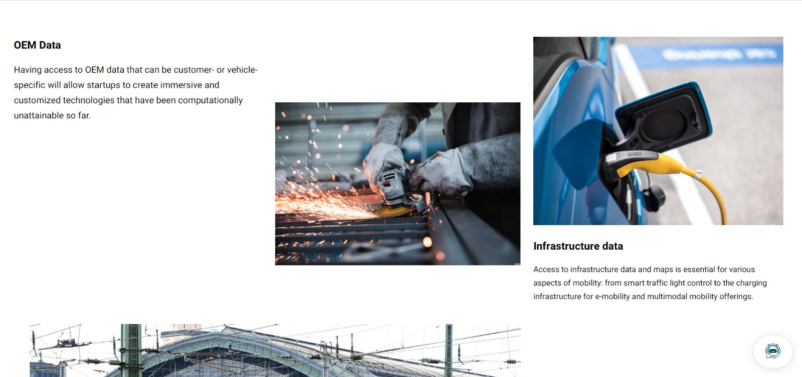
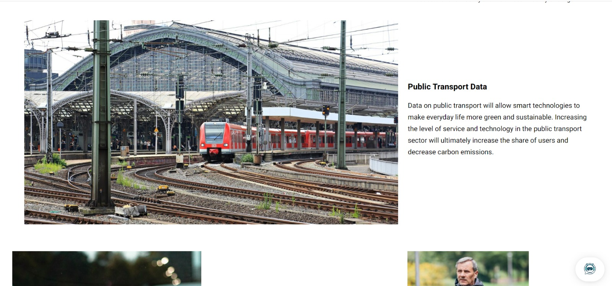
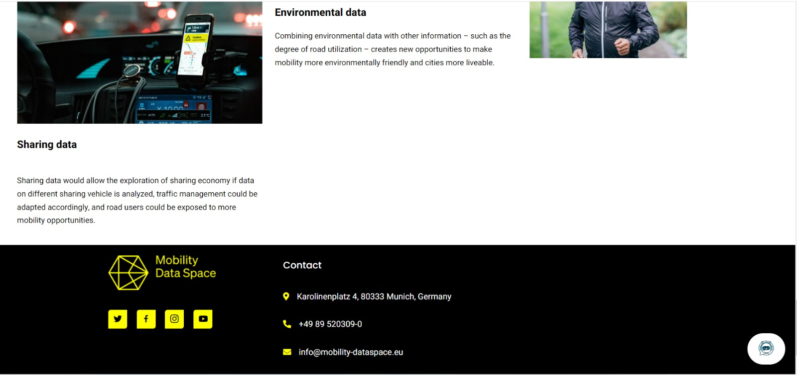

## Credits

Team f1 of Tech Challenge Summer Semester 2021/22

Markus: markus@27pilots.com  
Lukas: [Lukas.kirchhefer@gmail.com](mailto:Lukas.kirchhefer@gmail.com)  
Maria: veraruedamaria@gmail.com   
He Lin: helinchooi@gmail.com

For any questions regarding the approach, application as well as the description, feel free to contact us.

 
