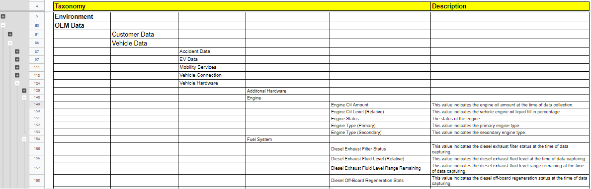

# AskMobi

AskMobi is a chatbot-based solution facilitating the process of searching for desired datasets, backed by a granular dataset taxonomy and filtering capabilities.

## Pitch Deck

[Link to Pitch Deck](https://pitch.com/public/1dd58031-dfdc-44d4-b6ac-bb41258ca27d)

## Explainer Video

[Link to explainer video](https://drive.google.com/file/d/1Nk2m565AZSDlsg2JY_5Z1OoD200MRGr3/view?usp=sharing)

## Prototype

[https://askmobi.ml/](https://askmobi.ml/)

## Data Taxonomy

[Link to Data Taxonomy](https://docs.google.com/document/d/1LDR_SdQjl4OGtH1i2zkJtaeD9365XN57Ii0Kg5q5ZM0/edit?usp=sharing)

## Background

AskMobi is a software solution which was developed by students of Technical University Munich during the Tech Challenge in the summer semester 2021/2022 for the [Mobility Data Space](https://mobility-dataspace.eu/). MDS has stated the challenge to analyze the readiness of this dataspace for the startup ecosystem. This guide will explain the idea and how the prototype was built.

### How do we help

<table>
  <tr>
   <td>Searchability
   </td>
   <td>Currently, there exist only a limited amount of searchable keywords based on the data structure of the MDS
   </td>
   <td>Time savings by providing a quick and intuitive keyword search functionality
   </td>
  </tr>
  <tr>
   <td>Accuracy
   </td>
   <td>The MDS lacks a tag-based data structure including a needed level of granularity and accuracy
   </td>
   <td>Increased search accuracy by implementing a granular and searchable data taxonomy
   </td>
  </tr>
  <tr>
   <td>Filterability
   </td>
   <td>Filtering possibilities are either insufficient or completely missing
   </td>
   <td>Filtering possibilities that allow to only display the search result a user is really interested in.
   </td>
  </tr>
</table>

### Data Taxonomy

The Data Taxonomy is the main source of information for AskMobi’s reasoning and guidance. It consists of over 480 different data categories arranged in a granular and structured Datatree with drop-down capabilities. Fundamentally, it is structured along five areas of data to the mobility industry. These five key areas were identified and defined in accordance with 12 interviews conducted with founders of Munich-based mobility startups, based on their relevance to the products and services these startups develop:    

1. Data on the **Environment: **This includes a variety of real-time and historical data on data points such as air quality, precipitation, wind, and others. Based on our customer interviews, this data is most relevant to startups operating in sustainable mobility 
2. Data provided by **OEMs** (e.g., BMW, Mercedes-Benz, Volkswagen, etc.): This mainly includes vehicle- or customer-specific data points, that can solely be provided by OEMs. Based on our customer interviews, this data is most relevant to startups providing modular enhancements and/or new services for vehicles 
3. Data on** Public Transport**: As the name indicates, this cluster includes a variety of data concerning public transport in Germany (e.g., passenger data, vehicle data, usage data, etc.). Based on our customer interviews, this data is most relevant for startups providing value-adding services for users of public transport.
4. Data on the **Sharing Ecosystem**: This cluster includes data centering on the concepts of vehicle sharing and ride-sharing. More specifically, this includes data on micromobility, carsharing, as well as on taxis, and ride-hailing. This data is most relevant to startups providing value-adding services for users of shared mobility.
5. Data on the **Mobility Infrastructure:** This cluster includes a variety of relevant data fields for the mobility ecosystem, including data on the German fuel network, road network, transportation industry, and security and surveillance. This data is most relevant to startups leveraging existing infrastructure to provide value-adding services for end-users.

As can be seen in the following image, for the final data taxonomy, relevant data points from these five key areas were aggregated and granularly structured using a drop-down functionality. In this way, for each key area, a user can start from the highest level of data specification, and iteratively select more specified data subclusters. Each data category then includes an explanatory description, making data discovery more intuitive for the end-user. 

The data points for these five key areas were aggregated from leading databases, that were identified through research and sourcing. These area-specific databases were provided by the following companies: \

* Caruso Dataplace
* Tomorrow.io
* Bundesministerium für Verkehr und Digitale Infrastruktur
* Catena-X
* Destatis
* BMW
* MobilityDB
* Gaia-X

For the process of data aggregation for the AskMobi Data Taxonomy, first, those databases were analyzed that provide very specific data on a specific key area. Exemplarily, tomorrow.io was identified as one of the leading global providers of environmental data. For the key area of “Environment”, relevant data points were taken from the Tomorrow.io developer portal (see image below)

This process was then replicated for the remaining key areas. In this way, we were able to identify very area-specific data categories that are relevant and industry-proven. Many databases also provided dataset descriptions (e.g., the Caruso developer portal for OEM-specific data).

As a result, we ended up with approximately 80% of our final data taxonomy. In the next step, we identified key gaps within the existing data taxonomy, and actively looked for data sources that can close these gaps. Especially Gaia-X, Catena-X, and MobilityDB were very beneficial for the identification of missing data points to complete the final data taxonomy for AskMobi. 

### Key Differentiators

<table>
  <tr style="font-weight:bold">
   <td>Competitor
   </td>
   <td>Conversational
   </td>
   <td>Database Integration
   </td>
   <td>Data Variability
   </td>
   <td>No-Code Solution
   </td>
   <td>Filter Capabilities
   </td>
   <td>Front-End Taxonomy
   </td>
  </tr>
  <tr style="font-weight:bold">
   <td>AskMobi (MDS)
   </td>
   <td>X
   </td>
   <td>X
   </td>
   <td>X
   </td>
   <td>X
   </td>
   <td>X
   </td>
   <td>X
   </td>
  </tr>
  <tr>
   <td>Forethought AI
   </td>
   <td>X
   </td>
   <td>X
   </td>
   <td>X
   </td>
   <td>X
   </td>
   <td>X
   </td>
   <td>
   </td>
  </tr>
  <tr>
   <td>AskJenny
   </td>
   <td>X
   </td>
   <td>X
   </td>
   <td>X
   </td>
   <td>X
   </td>
   <td>
   </td>
   <td>
   </td>
  </tr>
  <tr>
   <td>Talk-a-Bot
   </td>
   <td>X
   </td>
   <td>X
   </td>
   <td>X
   </td>
   <td>X
   </td>
   <td>
   </td>
   <td>
   </td>
  </tr>
  <tr>
   <td>Ada CX
   </td>
   <td>X
   </td>
   <td>X
   </td>
   <td>
   </td>
   <td>X
   </td>
   <td>
   </td>
   <td>
   </td>
  </tr>
  <tr>
   <td>Kore AI
   </td>
   <td>X
   </td>
   <td>X
   </td>
   <td>X
   </td>
   <td>
   </td>
   <td>
   </td>
   <td>
   </td>
  </tr>
</table>

### Tools used

#### Software/Technology Stack:

<table>
  <tr style="font-weight:bold">
   <td>Tool
   </td>
   <td>Usage
   </td>
   <td>Reference
   </td>
  </tr>
  <tr>
   <td>Landbot.io
   </td>
   <td>Implementation of chatbot
   </td>
   <td><a href="https://landbot.io">https://landbot.io</a> 
   </td>
  </tr>
  <tr>
   <td>Microsoft Excel
   </td>
   <td>Implementation of logic of data taxonomy
   </td>
    <td><a href="https://docs.google.com/document/d/1LDR_SdQjl4OGtH1i2zkJtaeD9365XN57Ii0Kg5q5ZM0/edit?usp=sharing">https://docs.google.com/document/d/1LDR_SdQjl4OGtH1i2zkJtaeD9365XN57Ii0Kg5q5ZM0/edit?usp=sharing</a> 
   </td>
  </tr>
  <tr>
   <td>WordPress
   </td>
   <td>Implementation of mock-up MDS Website
   </td>
   <td><a href="https://wordpress.com">https://wordpress.com</a> 
   </td>
  </tr>
  <tr>
   <td>VS Code IDE
   </td>
   <td>Code Editor
   </td>
   <td><a href="https://code.visualstudio.com">https://code.visualstudio.com</a> 
   </td>
  </tr>
  <tr>
   <td>Chrome Browser
   </td>
   <td>Testing of website in different screen sizes
   </td>
   <td>-
   </td>
  </tr>
  <tr>
   <td>Docker
   </td>
   <td>Platform that use OS-level virtualization to deliver software in packages called containers
   </td>
   <td><a href="https://www.docker.com/">https://www.docker.com/</a> 
   </td>
  </tr>
  <tr>
   <td>Digital Ocean
   </td>
   <td>Cloud infrastructure to host the website
   </td>
   <td><a href="https://www.digitalocean.com/">https://www.digitalocean.com/</a> 
   </td>
  </tr>
  <tr>
   <td>Nginx
   </td>
   <td>Web server
   </td>
   <td><a href="https://www.nginx.com/">https://www.nginx.com/</a> 
   </td>
  </tr>
  <tr>
   <td>Freenom
   </td>
   <td>Domain Provider
   </td>
   <td><a href="https://www.freenom.com/en/index.html?lang=en">https://www.freenom.com/en/index.html?lang=en</a> 
   </td>
  </tr>
</table>

#### Hardware:

Electronic devices with any size including mobile, tablet and desktop.

## Prototype

The Mobi chatbot will be a mean of communication between the user and the data space mobility. Therefore, this communication will take place in the interface that offers the data.

We recreated the data space mobility website, as the interface where the user can easily interact with the chatbot:

The chosen platform for designing the interface was WordPress.

The conversation starts when the user clicks on the white circle on the right bottom side.

An interactive conversation will start in order to guide the user to the dataset that he/she is looking for.

### Chatbot

#### Execution Plan:

The goals kept in mind to achieve a user-friendly and efficient tool were:

- Interactive and short questions
- Human-like bot
- Short but efficient conversation

There will be two ways of guiding the user:

1. By going node by node until finding the desired dataset topic
2. By jumping to the desired topic through the insertion of keywords

The first is based on a line of questions where the user lowers on the level of the taxonomy tree per question until reaching an ending node.

The second works by asking the user to insert keywords, where if there is a successful match among any node in the taxonomy tree, the user is guided through the following nodes that the selected node has, skipping all the higher levels of the tree.

#### Execution:

The platform used for the design and execution of the prototype was Landbot. The design is done by drag and drop features that are connected among them to indicate how the logic should be followed.

Along the diagram, 6 types of blocks were used. Followed by the description of the function, an explanatory block is shown:

1. Message:

This feature outputs a text that will be shown in the conversation.

2. Buttons:

Followed by a text, buttons will be given with different options on paths to take. Each path is linked to another node.

3. Question Text:

The chatbot will ask the user for a text input and the text is saved in a string variable.

4. Keyword Jump:

Receives a string variable as input and if it matches one of the nodes inside the tree it jumps to the matching node.

5. Send email:

Receives a string variable as input and sends the word to a previously entered email address.

Each of the features were used for the following tasks:

1. Message:

Welcome and goodbye message, indication that the inserted keyword was sent by email. All the ending nodes will be linked to a goodbye message. This one, has an add-on feature that the moment the conversation ends, the user can be redirected to an assigned URL. The URL will be the direction to the requested datasets.

2. Buttons:

For every node in the taxonomy tree there is a button to press that either takes the user to the next level of the tree or to the goodbye message that redirects the user to the dataset.

3. Question Text:

The chatbot asks the user if he/she already knows the word he/she is looking for, if yes, a text input is required. The text is saved in a variable called @name 

4.  Keyword Jump:

The input is the word @name. If the variable matches with one of the listed keywords saved in the feature it redirects the user to the given keyword. If the variable is not matched, a default path is followed. The user is asked if he/she agrees on sending the unfound keyword to the software developer as an improvement suggestion of the taxonomy.

5. Send email:

If the user agrees on sending the keyword to the previously assigned email address, the word will immediately arrive to the inbox of the address.

#### Overview of the chatbot taxonomy

*the chatbot was filled with a portion of the taxonomy tree as an illustrative prototype

### Website Setup

The website was setup based on the guide by Digital Ocean

[How To Install WordPress With Docker Compose](https://www.digitalocean.com/community/tutorials/how-to-install-wordpress-with-docker-compose)

Gutenverse theme was used to design the website.

## Credits

Team f1 of Tech Challenge Summer Semester 2021/22

Markus: markus@27pilots.com  
Lukas: [Lukas.kirchhefer@gmail.com](mailto:Lukas.kirchhefer@gmail.com)  
Maria: veraruedamaria@gmail.com   
He Lin: helinchooi@gmail.com

For any questions regarding the approach, application as well as the description, feel free to contact us.

 
